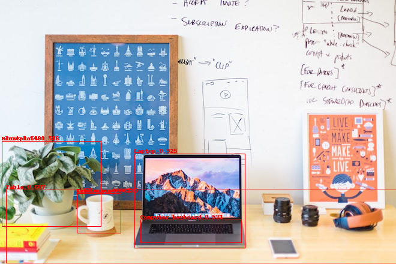
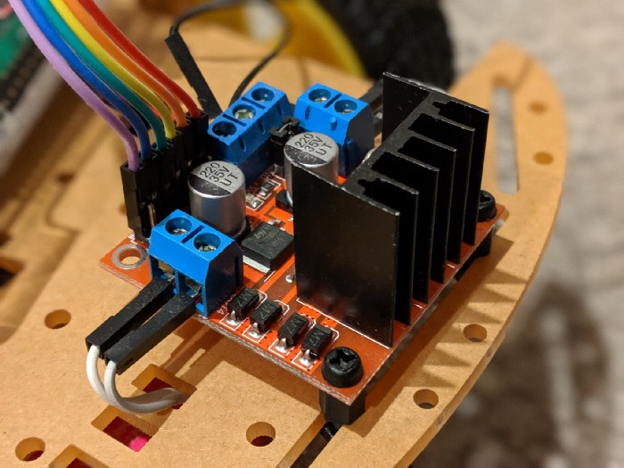
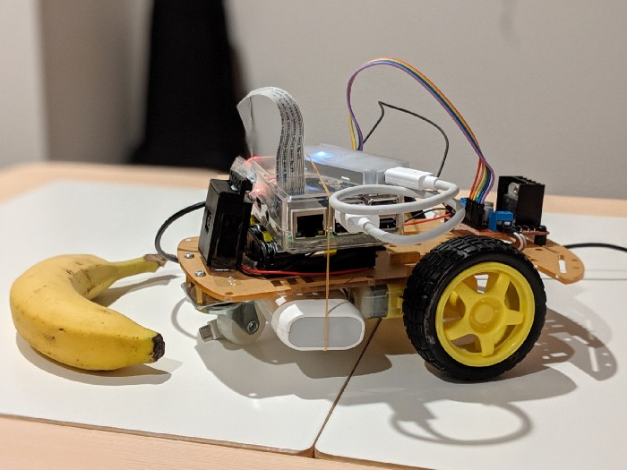

# project-banana-robo

This project implements a banana seeking robot with Coral Edge TPU. 
It uses a off-the-shelf object detection network that runs on the Edge TPU 
to control a set of simple motors. 
This project was built by Hayato Yoshikawa and originally published in a
[Medium blog post](https://medium.com/@hayatoy/making-a-banana-seeker-robot-with-coral-edge-tpu-169c993fc370)


## How does it work?

This robot is built on Raspberry Pi 3 B+ connecting L298N motor driver that drives 2 motors, and detecting object with camera accelerated by Coral USB Accelerator.


## Object Detection

Object Detection is an algorithm or a program that literally detects particular
object(s) within an image. Typically it addresses locations of objects with
rectangles (see attached image).
Today you can easily implement object detection because these technologies are
mostly using deep learning, and pre-trained models are provided by several sources.



## Raspberry Pi + Coral USB Accelerator + MobileNet SSD v2

It is a bit tough to run an object detection model on Raspberry Pi, because it
requires bunch of CPU resources thus it causes slow response on detection
(typically more than a second per image) even though you use a model made for
mobile usage such as MobileNet SSD. 
With [Coral USB Accelerator](https://coral.withgoogle.com/products/accelerator),
you can make the detection time more than 10x faster.

You can find a quick & easy walkthrough object detection demo with Edge TPU on 
[Coral website](https://coral.withgoogle.com/docs/edgetpu/api-intro/), but it
doesn’t have real-time demo. If you want to monitor what’s detected on camera
in real-time, you can make it with picamera and its overlay function.

```python
for foo in camera.capture_continuous(stream,
                                     format='rgb',
                                     use_video_port=True):
  # Make Image object from camera stream
  stream.truncate()
  stream.seek(0)
  input = np.frombuffer(stream.getvalue(), dtype=np.uint8)
  input = input.reshape((CAMERA_HEIGHT, CAMERA_WIDTH, 3))
  image = Image.fromarray(input)
  # image.save("out.jpg")

  # Make overlay image plane
  img = Image.new('RGBA',
                  (CAMERA_WIDTH, CAMERA_HEIGHT),
                  (255, 0, 0, 0))
  draw = ImageDraw.Draw(img)

  # Run detection
  start_ms = time.time()
  results = engine.DetectWithImage(image,
                                   threshold=0.2, top_k=10)
  elapsed_ms = (time.time() - start_ms)*1000.0
  if results:
    for obj in results:
      box = obj.bounding_box.flatten().tolist()
      box[0] *= CAMERA_WIDTH
      box[1] *= CAMERA_HEIGHT
      box[2] *= CAMERA_WIDTH
      box[3] *= CAMERA_HEIGHT
      # print(box)
      # print(labels[obj.label_id])
      draw.rectangle(box, outline='red')
      draw.text((box[0], box[1]-10), labels[obj.label_id],
                font=fnt, fill="red")
    camera.annotate_text = "{0:.2f}ms".format(elapsed_ms)
  if not overlay_renderer:
    overlay_renderer = camera.add_overlay(
      img.tobytes(),
      size=(CAMERA_WIDTH, CAMERA_HEIGHT), layer=4, alpha=255)
  else:
    overlay_renderer.update(img.tobytes())
```

## Motor driver

Meanwhile, we need to drive motors so that Raspberry Pi works like a robot!
Fortunately Raspberry Pi already has GPIO pins that can send and control
signals to external devices. But do not drive motors directly by GPIO, use
L298N H-Bridge DC motor driver instead. L298N motor driver can drives DC
motors by Raspberry Pi GPIO’s LVTTL signals.
You can control this motor driver with 3 GPIO pins for each motor, feeding
HIGH or PWM to EN pin and HIGH/LOW to IN1/2 pins. The code would be something
like below.

```python
import RPi.GPIO as GPIO
# Setup
GPIO.setmode(GPIO.BCM)
GPIO.setup(14, GPIO.out)  # connect to IN1
GPIO.setup(15, GPIO.out)  # connect to IN2
GPIO.setup(18, GPIO.out)  # connect to ENA
# Run a motor CW or CCW (depends on how you connect)
GPIO.output(14, GPIO.HIGH)
GPIO.output(15, GPIO.LOW)
GPIO.output(18, GPIO.HIGH)
```



If you are interested in the mechanism of this driver, refer to 
[this tutorial](https://howtomechatronics.com/tutorials/arduino/arduino-dc-motor-control-tutorial-l298n-pwm-h-bridge/).

## Simple Logic to Seek a Banana


## Wrap up — why on edge? why need accelerator?



You may wonder why we use object detection model on Edge TPU instead of Cloud
nor CPU? It depends on what application you need. In this application the robot
detects objects and drives motors for each frame, which is 10 frames per second.
What if it takes more than a second per frame? The robot must wait a second to
detect, drives motors, and wait a second and drives motors… You see, fast
iteration is needed for this application. As it’s written earlier CPU is a way
too slow for object detection, what about Cloud? It can be faster than Edge TPU
because you can use powerful GPU or even Cloud TPU. However detecting objects
on Cloud means you have to send images to Cloud for each frames, it requires
bandwidth and doesn’t work when offline.

